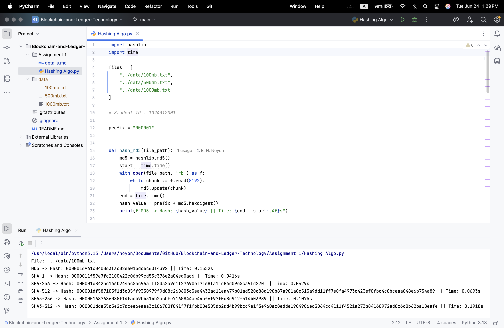

ICT 6106: Blockchain and Distributed Ledger Technologies

Assignment 1

22/06/2025

Total Mark: 10

Due: 25/07/2025

Comparative study of Different Hashing Algorithms

1. Implement the following hashing algorithms. Use existing library from Java, Python, etc.,
for implementation.
i. MD5
ii. SHA-1
iii. SHA-2 (256 bit)
iv. SHA-2 (512 bit)
v. SHA-3 (256 bit)
vi. SHA-3 (512 bit)
2. Download 3 text files from https://examplefile.com/
i. 1 GB
ii. 500 MB
iii. 100 MB
3. Using your program, generate hash values for the 3 files for each of the algorithms with
prefix 000XYZ, where XXX = Last 3 digits of your student ID.
4. Identify running time for each input file for the selected algorithms
5. Prepare a report with
1. Details of the library used for analysis
2. Screenshots of the outputs
3. Computer spec
4. Hash values
5. Comparative analysis
6. Submit the report in Teams in PDF format.

PLAGIARISM SOFTWARE WILL BE USED FOR DETECTION. ALL MATCHING
SUBMISSIONS WILL GET ZERO. 


### Output

```
Processing file: ../data/100mb.txt

MD5:
  Nonce: 23370
  Hash: 0001b6a94349b8d17f66c4dcf09ae397
  Time: 5615.2924 seconds
  
SHA1:
  Nonce: 47385
  Hash: 0001a97d7ce0e0d2f00159acfc1daf69ab76a5ec
  Time: 1845.8349 seconds
  
SHA256:
  Nonce: 1065
  Hash: 00011ad58c6bc9088c20e603e29abab993c2571d987e44776bcadbcead90832f
  Time: 41.4843 seconds
  
SHA512:
  Nonce: 26557
  Hash: 0001972b90010c79156b9de1ae0e57d54427f583d74a06fad3d58b1849713ea9345f7d6b3fd3f41129f8b974aaeff3bf766d1d4aa28da4a702ae7a6a409b7951
  Time: 1739.7821 seconds
  
SHA3_256:
  Nonce: 3503
  Hash: 0001710260e66ca8ed5ae7120da25b16537ad46500314b1637903dda519af3ab
  Time: 358.3933 seconds

SHA3_512
✅ Nonce found: 310203
Hash: 000189a54ae600984e6faabb917c4ce87a2a5c4b6a2099c958a128d2aad8dae6efc4c7861d9aaa0dc10a9ee256ad6c16015af21f193230843388d57a93ade42e
Time taken: 340.7804 seconds


Processing file: ../data/500mb.txt

MD5 � final timing:
  Nonce: 25035
  Hash: 000188add3452d8bc3033c5c50ae6d7e
  Time: 140.8984 seconds

SHA1 � final timing:
  Nonce: 395330
  Hash: 0001ca80b2d9148361375f2227fe9ac2d910049d
  Time: 2256.3788 seconds

SHA256 � final timing:
  Nonce: 80389
  Hash: 0001f99eb40e268ed9f3b2b866222dd1c60fbb9a1276e59013a5c09b52510ae8
  Time: 2852.9490 seconds

SHA512 � final timing:
  Nonce: 30647
  Hash: 0001d90f4e6061ea81f0097152745f624df66f3d09d761d31f3a6feb8cfc9481ccdc5a2bf2b762fd9be11a04e65c976c5ded5ce1eeb32976c1efeae1db84cad0
  Time: 3038.9849 seconds

SHA3_256 � final timing:
  Nonce: 30802
  Hash: 000165acd6f6e0d1c2cff990f2b3393aa6fbbdbc9bb7e6494311c3fb7187826b
  Time: 4623.0268 seconds

SHA3_512 � final timing:
  Nonce: 185443
  Hash: 000166232430b2bf79af5ac28cb41e79b3eee791f55e54f33f167f2fd298eee4787ca14b0441be4bc2349bda3bce28acca952e50a8a408c9e9182159bcc9007e
  Time: 3543.6543 seconds
  
  
Processing file: ../data/1000mb.txt
 
MD5 � final timing:
  Nonce: 187654
  Hash: 0001ae79e58ef72a79ca6f7240e7434e
  Time: 21617.9368 seconds

SHA1 � final timing:
  Nonce: 199075
  Hash: 00013bc78ce9e1848f314a382edad134791473e0
  Time: 21393.8858 seconds

SHA256 � final timing:
  Nonce: 21089
  Hash: 000135eed87c892535d750a1babb240bcf52bed5b95083fa199dd78bdbc580cf
  Time: 3839.3672 seconds

SHA512 � final timing:
  Nonce: 65226
  Hash: 0001938d37a3e32b638cef1552c4185620bf2ea4210887fa0079e7bc74c5601a74831b0f263df4a7b9a75d81b4d8c4728b24175a26d7915a61f320ac0ab04654
  Time: 813.7630 seconds

SHA3_256 � final timing:
  Nonce: 256483
  Hash: 000111ac1246a0a35df61b14d2d09ad5504a06ccb347aa5e565bef4133ac81eb
  Time: 47976.3882 seconds

SHA3_512 � final timing:
  Nonce: 40687
  Hash: 0001f90ea2b0ae94982e589bf82ff165fb561a724d55549b353cae98976bd4ff490c7b2062d78cec06e8fde459a6dec68fad7d026671647b81dac6d737582ab7
  Time: 5081.6096 seconds
```

### Screenshot

